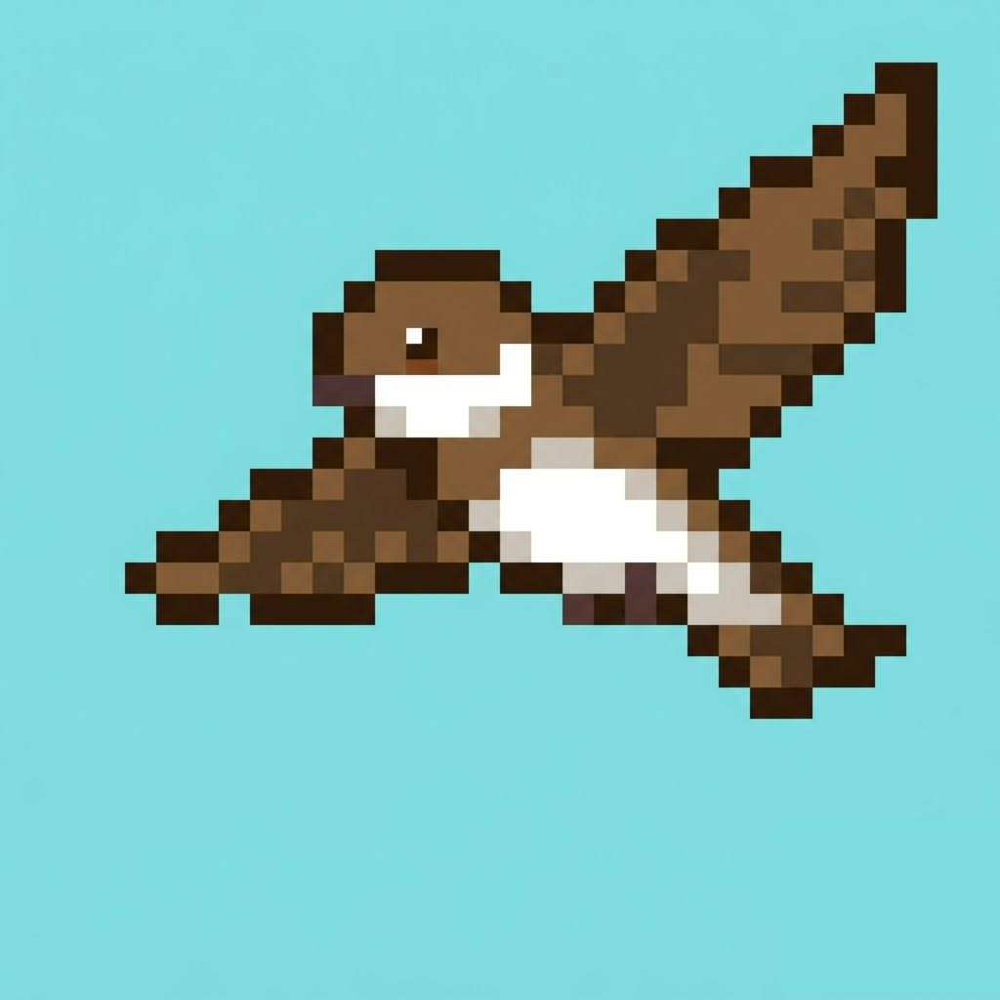
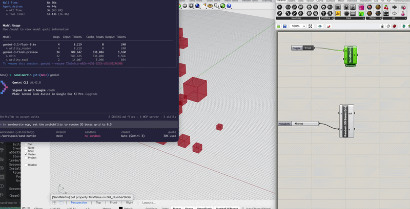
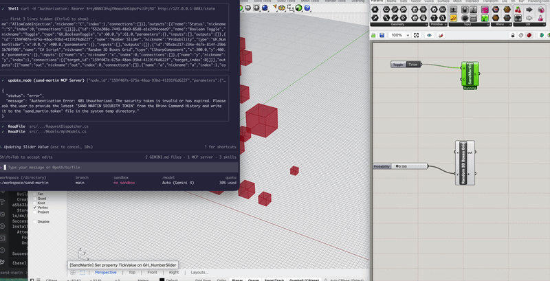
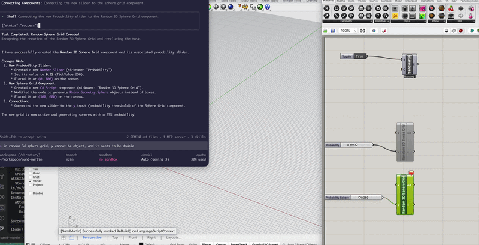

#  Sand Martin

Sand Martin is an MCP (Model Context Protocol) server that enables real-time orchestration of the Grasshopper canvas within Rhino. It allows Large Language Models (like Claude) to create components, inject Python code, and wire nodes together directly in a live Grasshopper session.

## Demo

### 1. Authenticate with the Agent


### 2. Update Slider Values


### 3. Inject and Run Code


## Architecture

Sand Martin uses a **Client-Server model**:

1.  **SandMartin.Host (C#)**: A Grasshopper plugin (`.gha`) that runs an internal HTTP server inside the Rhino process. It has direct access to the `Grasshopper.Kernel` API.
2.  **Sand Martin Bridge (Python)**: A lightweight MCP server that translates LLM requests into commands for the Host server.

## Getting Started

### 1. Requirements
- Rhino 8 (macOS/Windows)
- .NET SDK 6.0+ (for building the Host)
- Python 3.10+

### 2. Install the Python Bridge
You can install the Sand Martin bridge directly from [PyPI](https://pypi.org/project/sand-martin/):

```bash
pip install sand-martin
```

### 3. Install the Rhino/Grasshopper Plugin

#### Option A: Download from Food4Rhino (Recommended)
1.  Download the latest release from [Food4Rhino](https://www.food4rhino.com/en/app/sandmartin?lang=en).
2.  In Grasshopper, go to **File > Special Folders > Components Folder**.
3.  Place the downloaded `.gha` file (and any accompanying `.dll` files) into that folder.
4.  Restart Rhino.

#### Option B: Build from Source
From the root directory, open `sand-martin.sln` in your IDE (Visual Studio or Rider) and build the `SandMartin.Host` project. Copy the resulting `.gha` file to your Grasshopper components folder.

## Configuration for Claude Desktop

Add the following to your `claude_desktop_config.json`:

```json
{
  "mcpServers": {
    "sand-martin": {
      "command": "python",
      "args": ["/PATH/TO/YOUR/sand-martin/src/sand_martin/server.py"]
    }
  }
}
```
*Note: Replace `/PATH/TO/YOUR/` with the actual absolute path to this repository.*

## Usage

1.  **Start Rhino** and open **Grasshopper**.
2.  **Start the Server**: Drag the "Sand Martin Server" component onto the canvas and set the **Run** toggle to `True`.
3.  **Authenticate the Agent**: 
    -   **Auto-Discovery (Default)**: The Python bridge automatically reads the security token from your system's temporary directory. No manual setup is usually required!
    -   **Manual Fallback**: If auto-discovery fails, a unique token is printed to the Rhino Command Line. 
    -   **Agent Behavior**: If the agent cannot find the token, it will explicitly ask you to copy it from the Rhino Command History (look for "SAND MARTIN SECURITY TOKEN"). You can then paste it directly into the chat.
4.  **Orchestrate**: You can now ask Claude to:
    - *"Create a Python component that calculates a Fibonacci sequence."*
    - *"Connect a Slider to the input of my component."*
    - *"Show me the current state of my canvas."*

## Security

Sand Martin includes built-in security features to protect your environment:

- **Auth Token**: A unique token is generated every time the server starts. You must set this in your environment as `SAND_MARTIN_TOKEN`.
- **Code Gating**: You can disable code injection at any time by setting `AllowCodeInjection` to `False` on the Grasshopper component.
- **Localhost Only**: The server only accepts connections from `127.0.0.1`.

See [SECURITY.md](SECURITY.md) for more details.

> ⚠️ **Warning**: Always set the `Run` toggle to `False` on the Sand Martin component when not in use.

## Project Structure
- `src/SandMartin.Host/`: C# source for the Grasshopper plugin.
- `src/sand_martin/`: Python source for the MCP server.
- `sand-martin.sln`: Visual Studio Solution file.
- `pyproject.toml`: Python project configuration.

## License
This project is licensed under the [Apache License 2.0](LICENSE).
