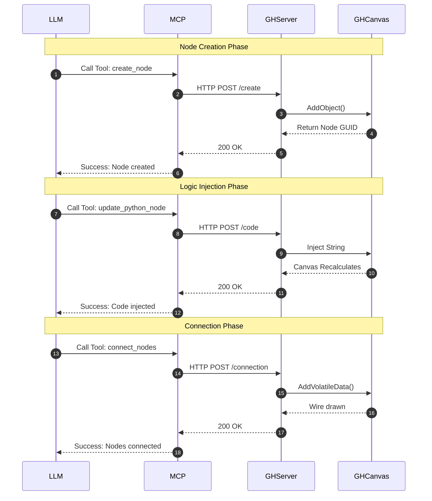

# Sand Martin (Grasshopper MCP) / Server Plan

## Overview
To support real-time CRUD operations on Grasshopper components, code injection, and canvas orchestration (wiring components together), the tool must interact directly with the live `Grasshopper.Kernel` API. 

Therefore, the architecture shifts from a static file CLI to a **Client-Server model** where a server runs *inside* the active Rhino/Grasshopper process.

## Architecture Diagram (UML)



## Architecture

### 1. The Rhino/Grasshopper Host Server (The Engine)
This is a listener running inside the active Rhino process. It has direct access to the `Grasshopper.Instances.ActiveCanvas` and the `Grasshopper.Kernel` API.
- **Implementation**: A C# Grasshopper Plugin (`.gha`).
- **Protocol**: Exposes a local HTTP/REST API or WebSocket server (e.g., on `localhost:8081`).
- **Capabilities**:
  - Add/Remove components to the canvas by GUID.
  - Inject or modify Python code inside a specific `GH_CPython` component.
  - Connect (wire) output parameters to input parameters.
  - Read the current state of the canvas (nodes, connections, coordinates).

#### Project Structure (C#)
```text
src/SandMartin.Host/
├── SandMartin.Host.csproj          # Project file with Rhino/Grasshopper SDKs
├── SandMartinHostInfo.cs           # Plugin identity (Name, GUID, Icon)
├── ServerLifecycle.cs              # Auto-start logic (GH_AssemblyPriority)
├── Models/
│   └── ApiModels.cs                # JSON structures for requests/responses
├── Services/
│   ├── HttpListenerServer.cs       # Background HTTP listener management
│   ├── RequestDispatcher.cs        # Route mapping & UI Thread marshaling
│   └── CanvasManager.cs            # Grasshopper.Kernel API orchestration
└── Scripts/
    └── postbuild.sh                # Script to deploy .gha to Rhino folder
```

### 2. Sand Martin (The MCP Server / LLM Bridge)
Since starting up full Rhino instances as an MCP standard-I/O child process is too slow/heavy, we run Sand Martin, a lightweight external Python MCP server that talks to the Rhino Host Server.
- **Implementation**: Python 3.10+ using `mcp.server.fastmcp`.
- **Role**: Translates LLM requests (like "connect component A to component B") into HTTP API calls sent to the Rhino Host Server.

## Proposed API / Tooling Capabilities

### CRUD & Code Injection
- `create_node(type: str, name: str, x: int, y: int)`: Instantiates a component on the canvas.
- `update_python_node(node_id: str, code: str)`: Injects new Python code into a specific Python component on the canvas.
- `delete_node(node_id: str)`: Removes a component.
- `get_canvas_state()`: Returns a JSON representation of all nodes and their IDs on the canvas.

### Orchestration (Wiring)
- `connect_nodes(source_id: str, source_output_index: int, target_id: str, target_input_index: int)`: Wires two components together.
- `disconnect_nodes(source_id: str, target_id: str)`: Removes wires between components.

## Implementation Steps
1. **Build the Rhino Listener**: Create a lightweight HTTP server inside Grasshopper that exposes the `Grasshopper.Kernel` API methods.
   - **1a. Plugin Setup**: Initialize a C# `.gha` plugin (or persistent Python script) to host the server process.
   - **1b. Background Server**: Implement an HTTP server (e.g., `System.Net.HttpListener`) listening on `localhost:8081` on a background thread.
   - **1c. UI Thread Marshaling**: Route incoming HTTP requests to the main thread using `Rhino.RhinoApp.InvokeOnUiThread()` to safely modify the Grasshopper canvas without crashing.
   - **1d. Endpoint Mapping**: Wire up the specific `/create`, `/code`, `/connection`, and `/state` routes to their respective `Grasshopper.Kernel` API equivalents.
2. **Build Sand Martin**: Implement the external FastMCP server that registers the tools (e.g., `create_node`, `connect_nodes`) and forwards them to the listener via `requests`.
3. **Test with LLM**: Connect Claude/Cursor to Sand Martin and prompt it to "Create a Python component that makes a circle, and wire it to a panel."