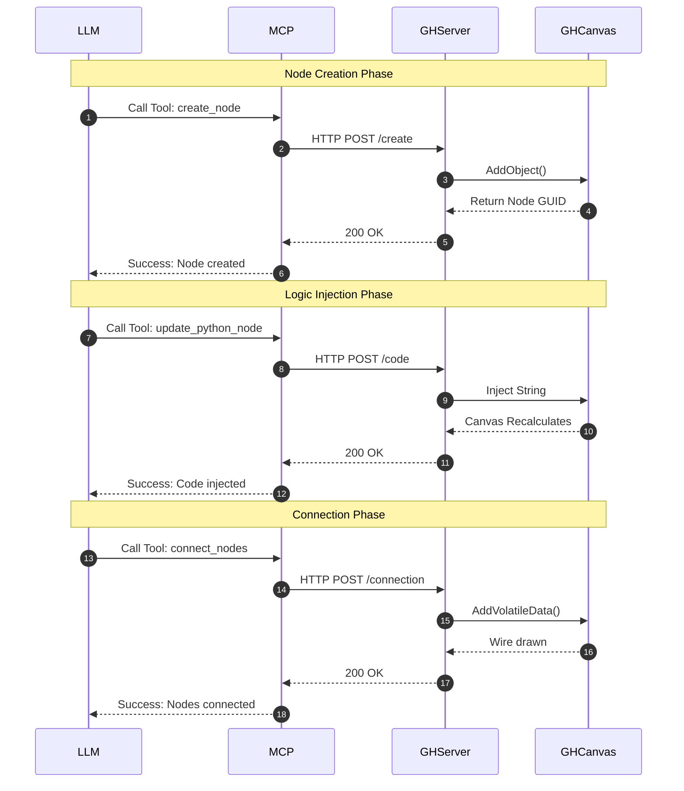

# Sand Martin (Grasshopper MCP) / Server Plan

## Overview
To support real-time CRUD operations on Grasshopper components, code injection, and canvas orchestration (wiring components together), the tool must interact directly with the live `Grasshopper.Kernel` API. 

Therefore, the architecture shifts from a static file CLI to a **Client-Server model** where a server runs *inside* the active Rhino/Grasshopper process.

## Architecture Diagram (UML)



## Architecture

### 1. The Rhino/Grasshopper Host Server (The Engine)
This is a listener running inside the active Rhino process. It has direct access to the `Grasshopper.Instances.ActiveCanvas` and the `Grasshopper.Kernel` API.
- **Implementation**: A C# Grasshopper Plugin (`.gha`).
- **Protocol**: Exposes a local HTTP/REST API or WebSocket server (e.g., on `localhost:8081`).
- **Capabilities**:
  - Add/Remove components to the canvas by GUID.
  - Inject or modify Python code inside a specific `GH_CPython` component.
  - Connect (wire) output parameters to input parameters.
  - Read the current state of the canvas (nodes, connections, coordinates).

#### Project Structure (C#)
```text
src/SandMartin.Host/
├── SandMartin.Host.csproj          # Project file with Rhino/Grasshopper SDKs
├── SandMartinHostInfo.cs           # Plugin identity (Name, GUID, Icon)
├── ServerLifecycle.cs              # Auto-start logic (GH_AssemblyPriority)
├── Models/
│   └── ApiModels.cs                # JSON structures for requests/responses
├── Services/
│   ├── HttpListenerServer.cs       # Background HTTP listener management
│   ├── RequestDispatcher.cs        # Route mapping & UI Thread marshaling
│   ├── CanvasManager.cs            # Facade for Grasshopper operations
│   ├── GrasshopperServiceBase.cs   # Shared logic for service managers
│   ├── NodeManager.cs              # Node-level CRUD operations
│   ├── ConnectionManager.cs        # Component wiring logic
│   └── StateManager.cs             # Canvas-wide state retrieval
└── Scripts/
    └── postbuild.sh                # Script to deploy .gha to Rhino folder
```

### 2. Sand Martin (The MCP Server / LLM Bridge)
Since starting up full Rhino instances as an MCP standard-I/O child process is too slow/heavy, we run Sand Martin, a lightweight external Python MCP server that talks to the Rhino Host Server.
- **Implementation**: Python 3.10+ using `mcp.server.fastmcp`.
- **Role**: Translates LLM requests (like "connect component A to component B") into HTTP API calls sent to the Rhino Host Server.

## Proposed API / Tooling Capabilities

### CRUD & Code Injection
- [x] `createNode(type: str, name: str, canvasX: int, canvasY: int)`: Instantiates a component on the canvas.
- [x] `updateNode(node_id: str, ...args)`: Update an existing component (e.g., position, name, or public writable properties). Returns errors if a property is not found or is read-only.
- [x] `delete_node(node_id: str)`: Removes a component.
- [x] `get_canvas_state()`: Returns a JSON representation of all nodes and their IDs on the canvas.
- [x] `get_node_details(node_id: str)`: Returns detailed dynamic state for a specific component. Uses reflection to discover all readable primitive properties, returned in a compact `{"v": value, "r": readonly}` format to save tokens.

### Orchestration (Wiring)
- [x] `connect_nodes(source_id: str, source_output_index: int, target_id: str, target_input_index: int)`: Wires two components together.
- [x] `disconnect_nodes(source_id: str, target_id: str)`: Removes wires between components.

## Grasshopper Component Reference

When using `create_node`, the `type` parameter must match the component's internal name or type name. Common components include:

| Category | Component Name / Type | Description |
| :--- | :--- | :--- |
| **Input** | `GH_NumberSlider` | A numeric slider for dynamic input. |
| **Input** | `GH_BooleanToggle` | A true/false toggle. |
| **Input** | `Panel` | A text panel for input or display. |
| **Script** | `CSharpComponent` | A C# script component. |
| **Script** | `Python2Component` | A Python 2.7 (IronPython) component. |
| **Script** | `Python3Component` | A Python 3 (Rhino 8) component. |
| **Geometry** | `Circle` | Creates a circle. |
| **Geometry** | `Line` | Creates a line between two points. |
| **Geometry** | `Point` | Creates a point. |

## Basic Agent System Prompt

To effectively use the Sand Martin MCP, the agent should follow this strategic loop:

> **System Instruction**: The agent should first ensure it has an active authentication token. If the user hasn't provided one or if the tools return an authentication error, the agent **MUST ask the user to copy the token from the Rhino Command History** (look for "SAND MARTIN SECURITY TOKEN"). Once authenticated, the agent should use `get_canvas_state` and `get_node_details` to read the current canvas information and understand user intent. It should outline a "creation map" (logical steps for components and connections) and then start using `create_node`, `update_node`, or `connect_nodes` to make changes iteratively. Always verify the canvas state after major modifications.

## Implementation Steps
1. **Build the Rhino Listener**: Create a lightweight HTTP server inside Grasshopper that exposes the `Grasshopper.Kernel` API methods.
   - **1a. Plugin Setup**: Initialize a C# `.gha` plugin (or persistent Python script) to host the server process.
   - **1b. Background Server**: Implement an HTTP server (e.g., `System.Net.HttpListener`) listening on `localhost:8081` on a background thread.
   - **1c. UI Thread Marshaling**: Route incoming HTTP requests to the main thread using `Rhino.RhinoApp.InvokeOnUiThread()` to safely modify the Grasshopper canvas without crashing.
   - **1d. Endpoint Mapping**: Wire up the specific `/create`, `/code`, `/connection`, and `/state` routes to their respective `Grasshopper.Kernel` API equivalents.
2. **Build Sand Martin**: Implement the external FastMCP server that registers the tools (e.g., `create_node`, `connect_nodes`) and forwards them to the listener via `requests`.
3. **Test with LLM**: Connect Claude/Cursor to Sand Martin and prompt it to "Create a Python component that makes a circle, and wire it to a panel."

## Development Workflow

### Pre-commit Hook
To ensure code quality and prevent regressions, we use the `pre-commit` framework. This is mandatory for all contributors.

To set up the hook locally:
1. Install the dependencies:
   ```bash
   pip install -r requirements.txt
   ```
2. Install the git hook:
   ```bash
   pre-commit install
   ```

The hook will now run the full test suite (`run_tests.sh`) before every commit.

### Releasing to PyPI

To publish a new version of the Sand Martin Python bridge to PyPI:

1.  **Update Version**: Increment the `version` field in `pyproject.toml`.
2.  **Ensure Environment is Ready**:
    Activate your virtual environment:
    ```bash
    source .venv/bin/activate
    ```
3.  **Install Build Tools**:
    ```bash
    pip install build twine
    ```
4.  **Build the Distribution**:
    ```bash
    # This generates .tar.gz and .whl files in the /dist directory
    python3 -m build
    ```
5.  **Validate the Package**:
    ```bash
    python3 -m twine check dist/*
    ```
6.  **Upload to PyPI**:
    ```bash
    # To upload to TestPyPI first (Recommended)
    python3 -m twine upload --repository testpypi dist/*

    # To upload to the real PyPI
    # Note: Use '__token__' as username and your PyPI API token as password
    python3 -m twine upload dist/*
    ```

## Submitting to Food4Rhino

For the Grasshopper host plugin (`.gha`), follow these steps for a release:

1.  **Build Release**: Build the project in Release mode (or ensure `SandMartin.Host.dll` is current).
2.  **Package Assets**: 
    Create a folder containing:
    - `SandMartin.Host.gha` (Renamed from `.dll`)
    - `Newtonsoft.Json.dll`
    - `LICENSE`
    - `README.txt` (Installation instructions)
3.  **Zip and Upload**: Zip the folder and upload to Food4Rhino with the project icon and screenshots.